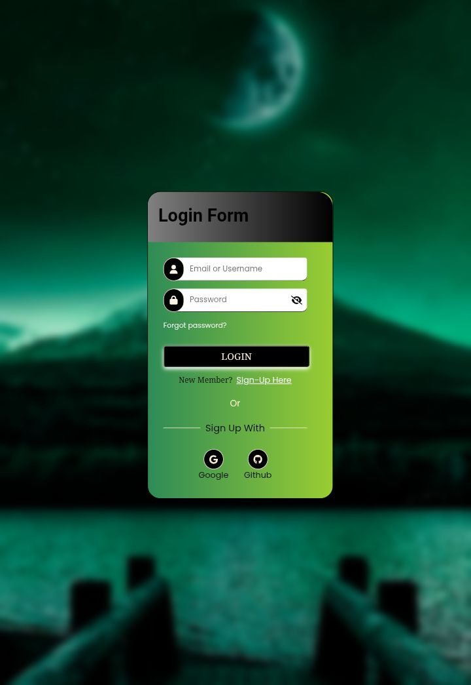

*Login & Sign Up UI (HTML/CSS/JS)*


## 💬 Description:

Login & Sign Up UI (HTML/CSS/JS).
This project showcases a static login and sign-up interface built using HTML, CSS, and JavaScript. It is a UI-only prototype intended for learning and design demonstration purposes.

## 🗺️ Features:

----------Login Page:-------------

_Username & Password Input: Users can enter login credentials.

_Navigation of Login to password recovery: Users can click the forget password to reset and return back to the login screen.

_Password Visibility Toggle: Click the eye icon to show/hide the password.

_Sign Up Redirect: Don’t have an account? Click the Sign Up link to go to the registration form.

_Social Login Buttons: Non-functional buttons that visually represent login options with:

      Google          GitHub

Note: This is a static UI. The login button does not validate or authenticate users.

----------Sign-Up Page:-----------

_User Registration Form: Fields for username, email, password, and confirm password.

_Password Strength Checker: Checks for minimum length. 
Checks for uppercase, lowercase, numbers, or symbols.

_Password Match Checker: Warns if passwords don’t match.

_Navigation Back to Login: Easy return to the login screen.

## 💻 Technologies Used:

      HTML5   CSS3 and  Vanilla       JavaScript

## 📂 Project Structure:

```
/login signup ui
│
├── login.html    # Login UI
├── signup.html   # Sign Up UI 
├── message.html  # Recovery
├── signup.css    # Shared style
├── signup.js   # BasicInteractive
├── README.md
└── images/
        └─ password_icon.jpg
        └─ moon.jpg
        └─ login-screenshot.png
        └─ signup-screenshot.png
```

## ⚙️ How to Use:
Clone or download this repository

1. git clone https://github.com/Benson-Jamie/login-signup-form-ui.git
   
2. Open `login.html' & 'signup.html` in your browser.

## 🖼️ Screenshots:




## 📫 Contact:

Feel free to reach out via [email](mailto: zvibes3@gmail.com).

---

      License
This project is for educational/demo purposes only.

